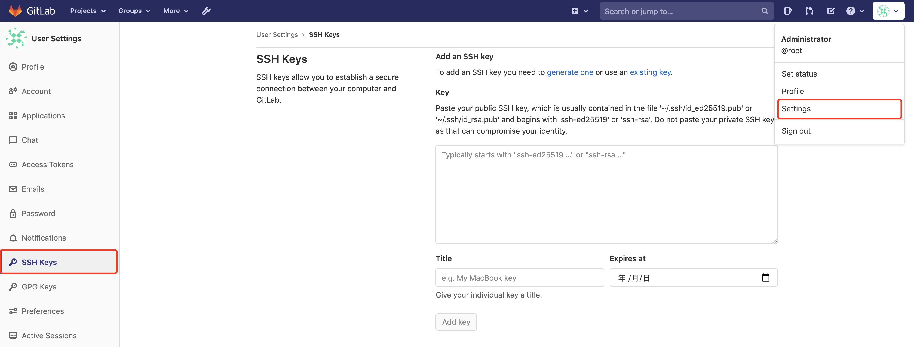
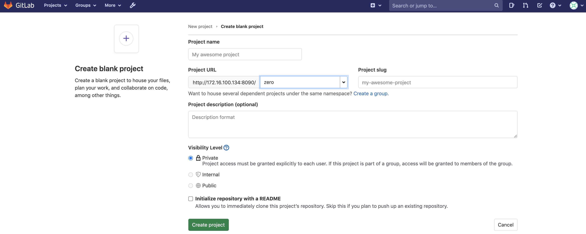
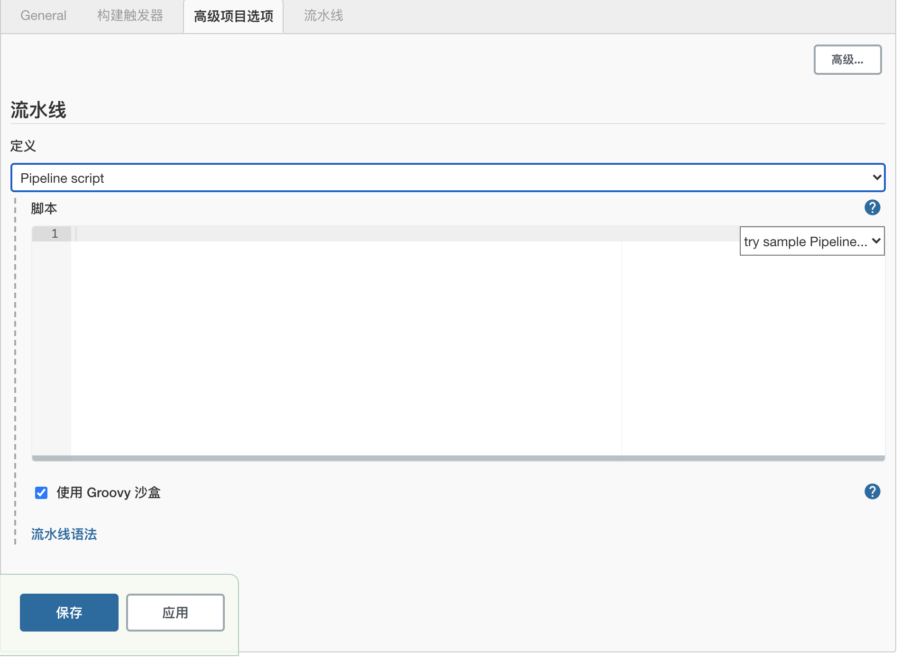

# 服务部署

# 准备工作

详情见[准备工作](./prepare.md)

# gitlab

## 添加SSH Key

进入gitlab，点击用户中心，找到`Settings`，在左侧找到`SSH Keys`tab


* 1、在jenkins所在机器上查看公钥

``` shell
$ cat ~/.ssh/id_rsa.pub
```

* 2、如果没有，则需要生成，如果存在，请跳转到第3步

``` shell
$ ssh-keygen -t rsa -b 2048 -C "email@example.com"
```

> "email@example.com" 可以替换为自己的邮箱
>
完成生成后，重复第一步操作

* 3、将公钥添加到gitlab中

## 上传代码到gitlab仓库

* 1、创建group名称为`zero`
  
* 2、创建project
  
* 3、上传代码到gitlab
  

# jenkins

## 添加凭据

* 查看jenkins所在机器的私钥，与前面gitlab公钥对应

``` shell
$ cat id_rsa
```

* 进入jenkins，依次点击`Manage Jenkins`-> `Manage Credentials`
  

* 进入`全局凭据`页面，添加凭据，`Username`是一个标识，后面添加pipeline你知道这个标识是代表gitlab的凭据就行，Private Key`即上面获取的私钥
  

## 添加一个Pipeline

> pipeline用于构建项目，从gitlab拉取代码->生成Dockerfile->部署到k8s均在这个步骤去做，这里是演示环境，为了保证部署流程顺利，
> 需要将jenkins安装在和k8s集群的其中过一个节点所在机器上，我这里安装在master上的。

* 获取凭据id 进入凭据页面，找到Username为`gitlab`的凭据id
  

* 进入jenkins首页，点击`新建Item`，名称为`user-service`
  
  

* 查看项目git地址


* 配置`user-serivce`
  在`user-service`配置页面，向下滑动找到`Pipeline script`
  