# centOS安装

> 作者：[松妹子](https://github.com/anqiansong)
>
> 日期：2020年01月14日

# 下载centOS

* 版本： centOS 7
* 下载地址：[centOS下载入口](https://www.centos.org/download/)

# 安装centOS

## 虚拟机准备

* 打开VMware Fusion，新建
  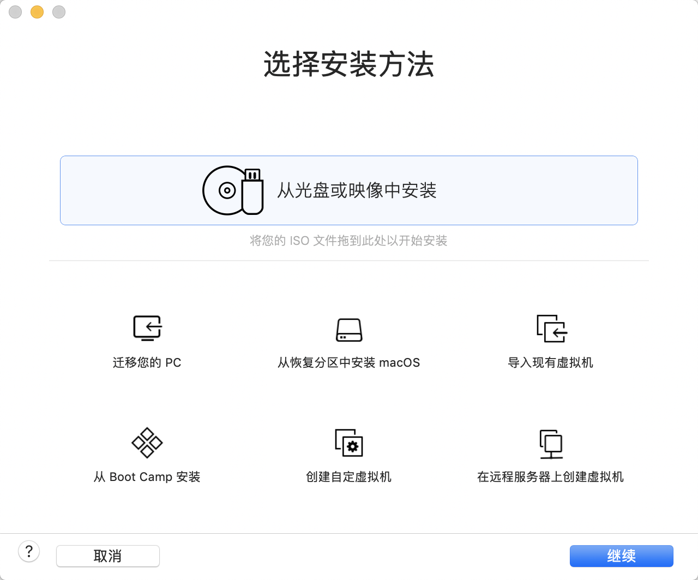
* `继续`，选择`从光盘或映像中安装`，找到已经下载好的centOS iso文件
  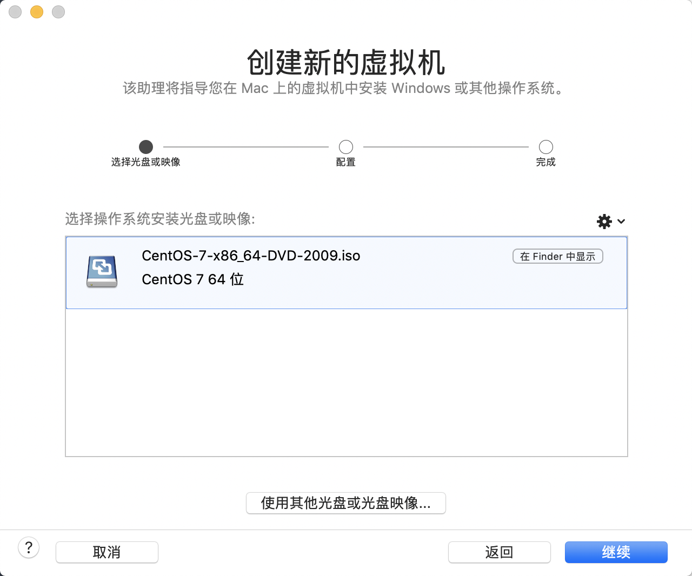
* `继续`，后续默认即可，直至完成
  
  
* 完成保存为`master`

## 安装

* 启动`master`虚拟机，进入centOS启动页
  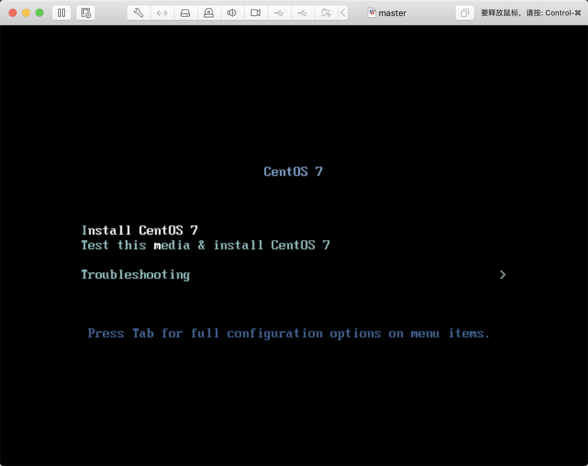
* 通过上下键移动，选择`Install CentOS 7`，回车
  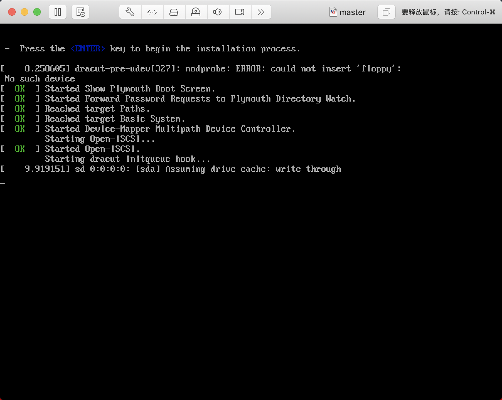
* 选择语言`中文`后`继续`
  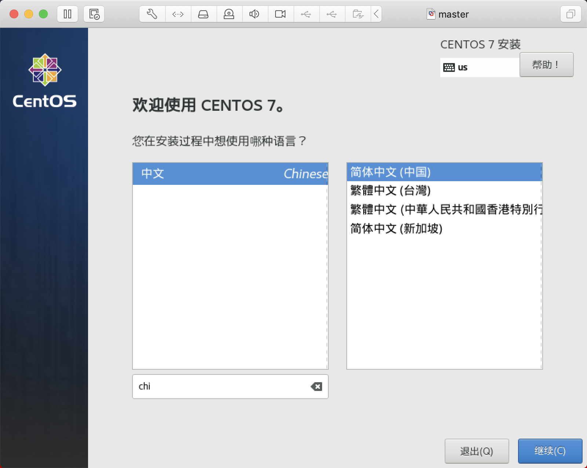
* 网络设置
  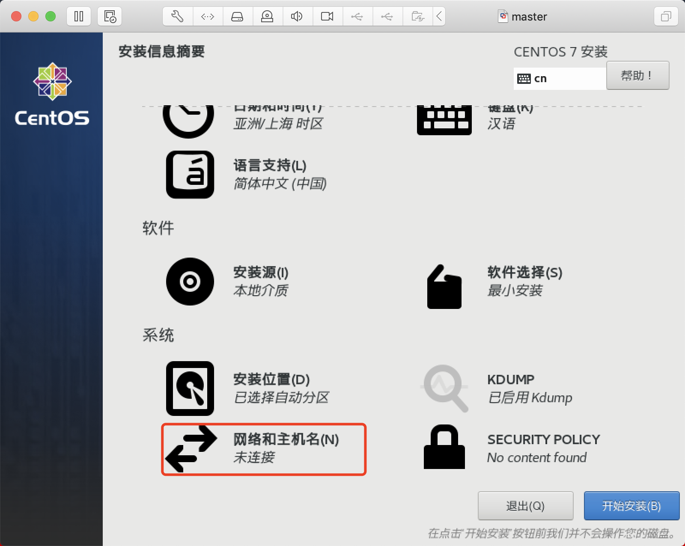
* 选择`打开`网络，并修改`主机`名称为`master`，点击`应用`，最后点击`完成`
  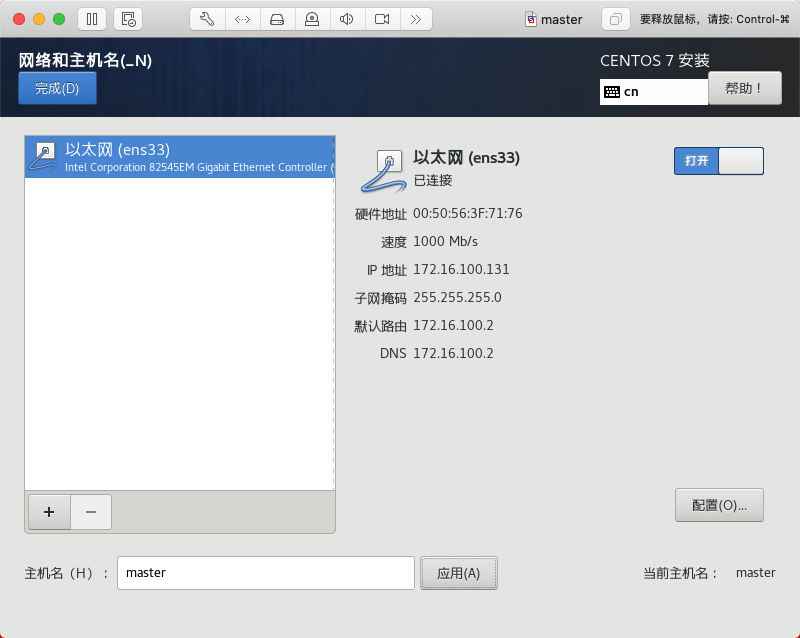
* 点击`开始安装`
  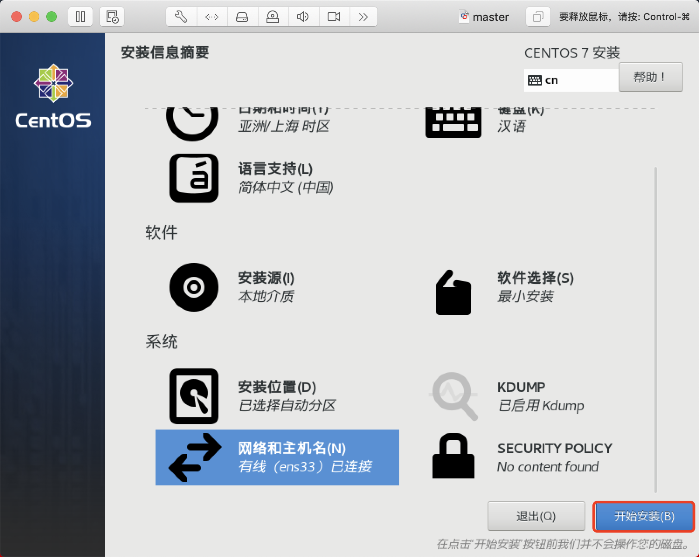
* 点击`ROOT 密码`进入密码设置页面
  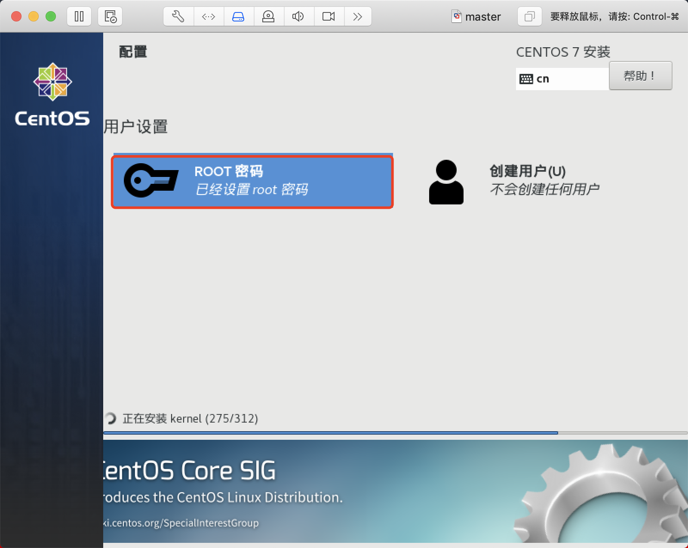
* 设置好密码后，点击`完成`(密码自行记住，后续登录需要用，这里暂时不添加用户了)
  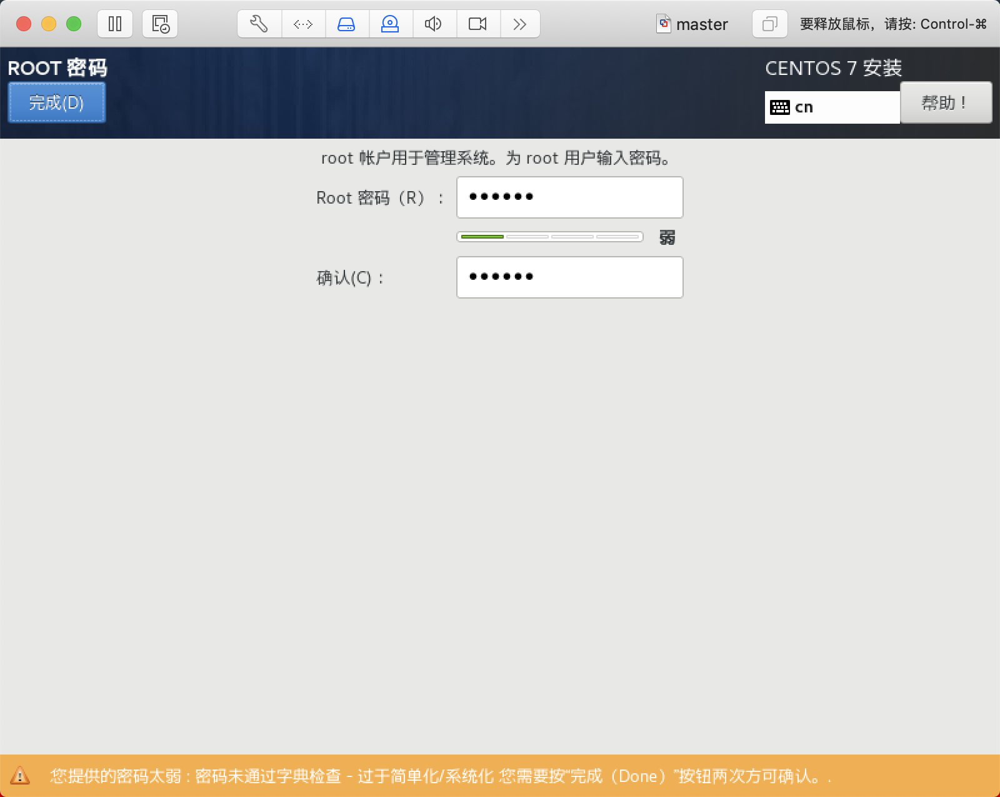
* 等待安装完成后`重启`
  
* 重启后登录系统验证,输入用户名`root`，密码为刚刚自行设置的密码
  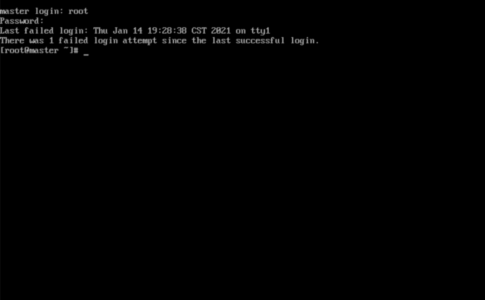
* 至此，centOS就安装完成了

# centOS设置

> 这里为了操作美感，在启动虚拟机后通过在iTerm2中利用ssh链接到centOS后进行后续操作。

## 查看master ip

进入centOS

``` shell
$ ip addr
```

``` text
1: lo: <LOOPBACK,UP,LOWER_UP> mtu 65536 qdisc noqueue state UNKNOWN group default qlen 1000
    link/loopback 00:00:00:00:00:00 brd 00:00:00:00:00:00
    inet 127.0.0.1/8 scope host lo
       valid_lft forever preferred_lft forever
    inet6 ::1/128 scope host
       valid_lft forever preferred_lft forever
2: ens33: <BROADCAST,MULTICAST,UP,LOWER_UP> mtu 1500 qdisc pfifo_fast state UP group default qlen 1000
    link/ether 00:0c:29:77:a8:e7 brd ff:ff:ff:ff:ff:ff
    inet 172.16.100.135/24 brd 172.16.100.255 scope global noprefixroute dynamic ens33
       valid_lft 1347sec preferred_lft 1347sec
    inet6 fe80::9b9b:e5b8:8941:5a6f/64 scope link noprefixroute
       valid_lft forever preferred_lft forever
```

## 登录ssh

``` shell
$ ssh root@172.16.100.135 -p 22
```

``` text
The authenticity of host '172.16.100.135 (172.16.100.135)' can't be established.
ECDSA key fingerprint is SHA256:sv99JzCzhchM0zKNnS3RNMgJbqCbE0nLRDXXdEQiuBE.
Are you sure you want to continue connecting (yes/no)? 
```

在第一次登录时会询问你是否继续链接，输入`yes`

``` text
yes
```

``` text
Warning: Permanently added '172.16.100.135' (ECDSA) to the list of known hosts.
root@172.16.100.135's password:
Last login: Thu Jan 14 21:58:25 2021
```

## 安装wget

``` shell
$ yum -y install wget
```


## 备份repo

``` shell
$ mv /etc/yum.repos.d/CentOS-Base.repo /etc/yum.repos.d/CentOS-Base.repo.bak
```

## yum配置阿里云

* 下载阿里云repo

``` shell
wget -O /etc/yum.repos.d/CentOS-Base.repo http://mirrors.aliyun.com/repo/Centos-7.repo
```

* 清除和生成缓存

``` shell
$ yum clean all
```

``` shell
$ yum makecache
```

## 关闭防火墙

> 关闭防火墙和selinux是为了后续顺利安装k8s做准备。

``` shell
$ systemctl stop firewalld.service
$ systemctl disable firewalld.service
```

## 关闭selinux

* 临时关闭

``` shell
$ setenforce 0
```

* 永久关闭

``` shell
$ vi /etc/selinux/config
```

设置SELINUX=disabled

# 虚拟机设置

> 为了保证后续k8s稳定安装，需要设置一下虚拟机配置，设置处理器为2核+，内存为2048MB+


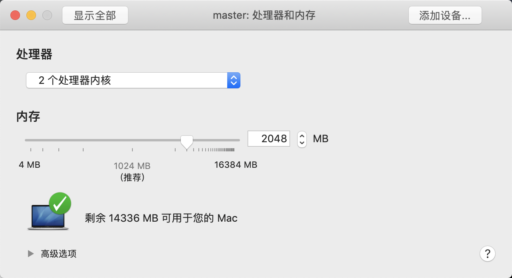


# 克隆虚拟机
> 至此，一台虚拟机已经准备好了，由于我们需要一台虚拟机来做master节点，2台虚拟机来做node节点，因此我们需要再克隆两台虚拟机出来。
> 克隆的虚拟机和master配置一样的，因此不用重新重新配置了。
> 在克隆前先关掉虚拟机

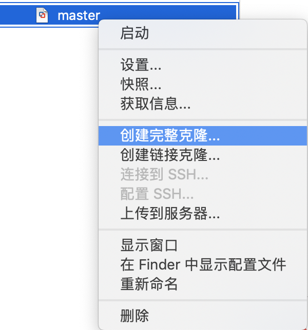
克隆出两台虚拟机名称分别为node1、node2

# 设置静态ip
* 分别在进入虚拟机设置，并对`网络适配器`进行设置，点击`高级选项`，生成MAC地址，要确保三个虚拟机的MAC地址不能一样，记住每个虚拟机名称对应的mac地址。
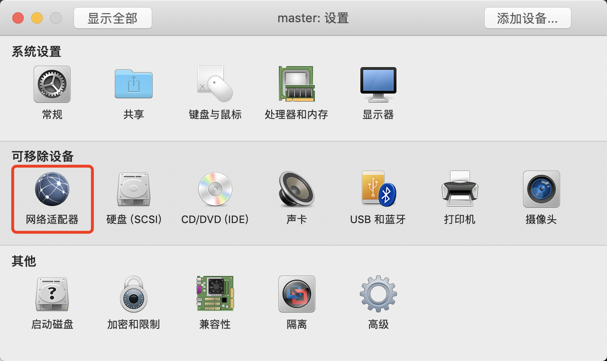


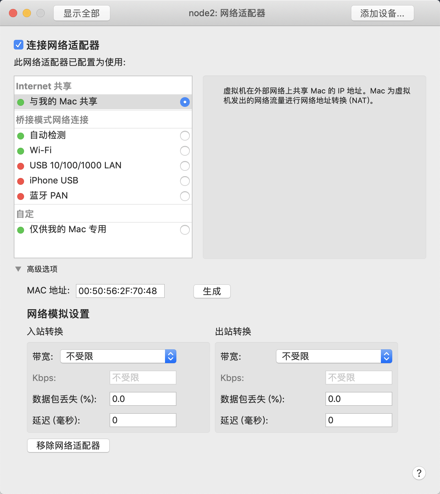

* 编辑dhcpd.conf
  ``` shell
  $ sudo vi /Library/Preferences/VMware\ Fusion/vmnet8/dhcpd.conf
  ```
* 指定master的ip为172.16.100.131，node1的ip为172.16.100.132，node2的ip为172.16.100.133,在文末填充如下内容后，保存。
  ``` text
  host master{
          hardware ethernet 00:50:56:3F:71:76;
          fixed-address 172.16.100.131;
  }
  
  host node1{
          hardware ethernet 00:50:56:3B:B7:98;
          fixed-address 172.16.100.132;
  }
  
  host node2{
          hardware ethernet 00:50:56:2F:70:48;
          fixed-address 172.16.100.133;
  }
  ```
## 参考链接

以上文档部分参考自[Centos7.6操作系统安装及优化全纪录](https://blog.51cto.com/3241766/2398136)

